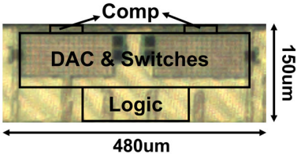

I am a third year PhD student at MIT EECS advised by Professor [Anantha Chandrakasan](https://chandrakasan.mit.edu/) and Professor [Hae-Seung Lee](https://hslee.mit.edu/). I work in circuit design with a focus on mixed-signal security and in-memory computing. I have multiple tape-out experiences with analog, mixed-signal, and digital cirucits.

Before joining MIT, I received a bachelor's degree in EECS from Peking University in 2019. I also did a summer internship at UC Austin working with Professor Nan Sun.

You can access my curriculum vitae [here](misc/CV_Ruicong_Chen.pdf).

# News

*  Jun. 2022. MIT NEWS has an [article](https://news.mit.edu/2022/analog-digital-converter-attack-side-channel-0614) to highlight our chip!
*  May. 2022. Direct HESE SAR is accepted to ISLPED 2022.  
*  Mar. 2022. RaM-SAR is accepted to VLSI-C 2022!  
*  Sep. 2020. Our paper is accepted to MobiCOM 2020!  

# Publications

### **RaM-SAR: A Low Energy and Area Overhead, 11.3fJ/conv.-step 12b 25MS/s Secure Random-Mapping SAR ADC with Power and EM Side-Channel Attack Resilience**
<u>Ruicong Chen</u>, Hanrui Wang, Anantha Chandrakasan, Hae-Seung Lee 
The 2022 Symposium on VLSI Circuits (VLSI-C), 2022. 
[[paper]](https://ieeexplore.ieee.org/document/9830365) 

### **A Bit-level Sparsity-aware SAR ADC with Direct Hybrid Encoding for Signed Expressions for AIoT Applications**
<u>Ruicong Chen</u>, H. T. Kung, Anantha Chandrakasan, Hae-Seung Lee  
The 2022 International Symposium on Low Power Electronics and Design (ISLPED), 2022.  

### **Self-Reconfigurable Micro-Implants for Cross-Tissue Wireless and Batteryless Connectivity**
Mohammed Radewan Abdelhamid, <u>Ruicong Chen</u>, Jongyuk Cho, Anantha Chandrakasan, Fadel Adib  
The 2020 Annual International Conference on Mobile Computing and Networking (MobiCom), 2020.  
[[paper]](https://dl.acm.org/doi/abs/10.1145/3372224.3419216) [[website]](https://www.media.mit.edu/projects/umedic/overview/)

# Chip Gallery

* RaM-SAR: The first secure ADC for video applications!

*  Wireless and Batteryless Self-Reconfigurable Micro-Implants for Cross-Tissue Biomedical Applications  

# Honors and Awards

*  2021 MIT EECS Commlab Fellowship  
*  2019 Outstanding Graduate in Beijing  
*  2019 Outstanding Graduate of Peking University  
*  2017 China National Scholarship  

# Services

*  Circuit Session Chair of MIT MTL Annual Research Conference (MARC) 2022  

